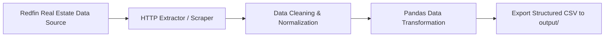

# 🏡 Real Estate Housing Market Data Extraction & ETL Pipeline

[](https://www.python.org/)
[](https://en.wikipedia.org/wiki/Extract,_transform,_load)
[](LICENSE)

An automated Python ETL (Extract, Transform, Load) pipeline designed to extract real estate housing market data (such as Redfin property listings), clean and normalize raw dataset records, and persist structured CSV output for analytics and data visualization.

---

## 🔄 ETL Pipeline Architecture



---

## 🚀 Key Features

- **Automated Data Extraction:** Scrapes housing listings, pricing parameters, locations, and property specs.
- **Data Transformation:** Cleans missing fields, normalizes prices, and standardizes geospatial column headers.
- **CSV Data Persistence:** Automatically writes cleaned output datasets to `./output/housing_data.csv`.
- **Modular Design:** Extendable pipeline architecture for multi-region housing analysis.

---

## 🛠️ Tech Stack & Dependencies

- **Language:** Python 3.9+
- **Libraries:** `requests`, `pandas`, `beautifulsoup4`

---

## ⚙️ Local Setup & Execution

```bash
# Clone the repository
git clone https://github.com/ManaliS24/ExtractSaveHousingData.git
cd ExtractSaveHousingData

# Create virtual environment
python -m venv venv

# Activate virtual environment
# Windows:
venv\Scripts\activate
# Mac/Linux:
source venv/bin/activate

# Install dependencies
pip install requests pandas beautifulsoup4

# Run the ETL pipeline
python main.py
```
Output files will be generated in `./output/`.
